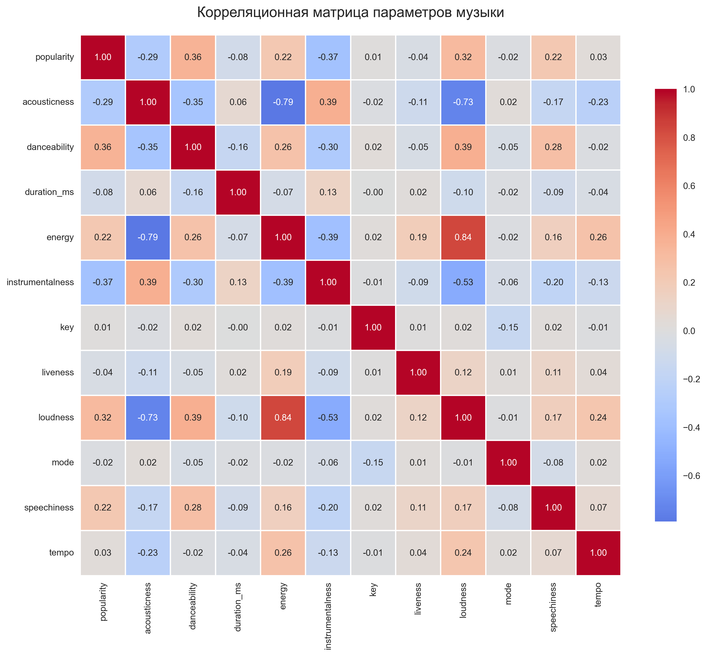
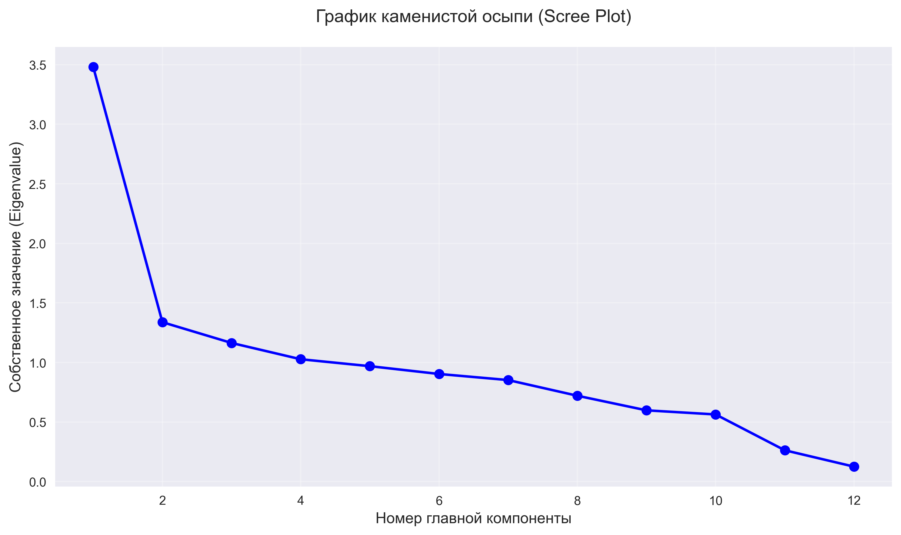
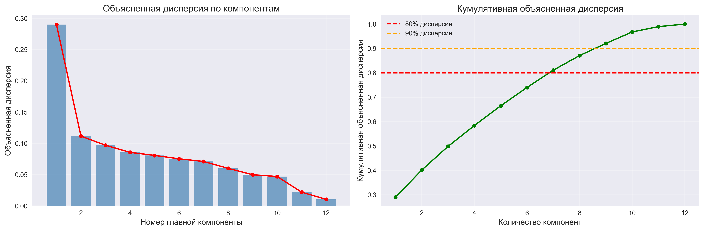
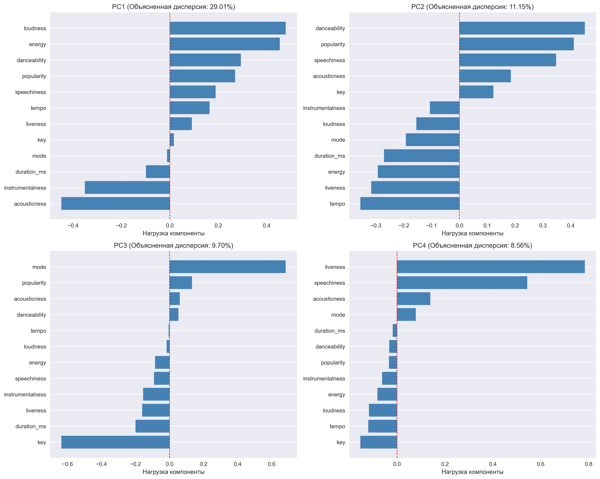
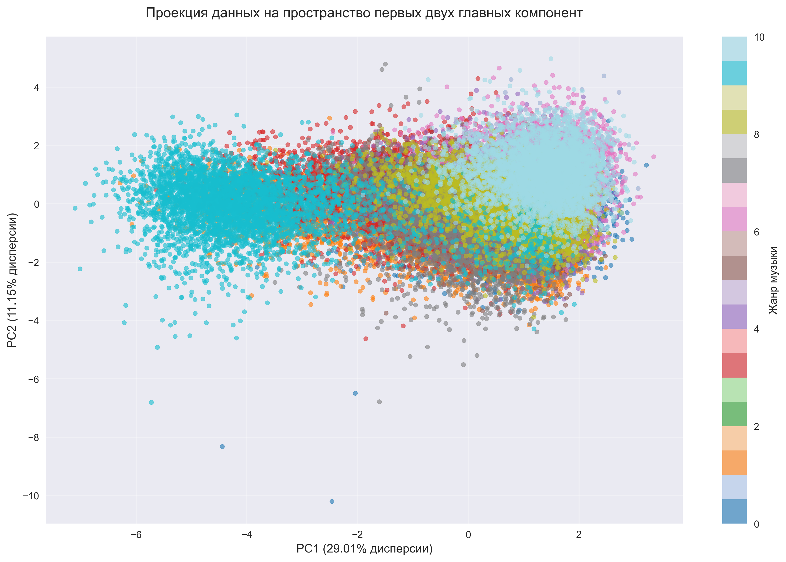
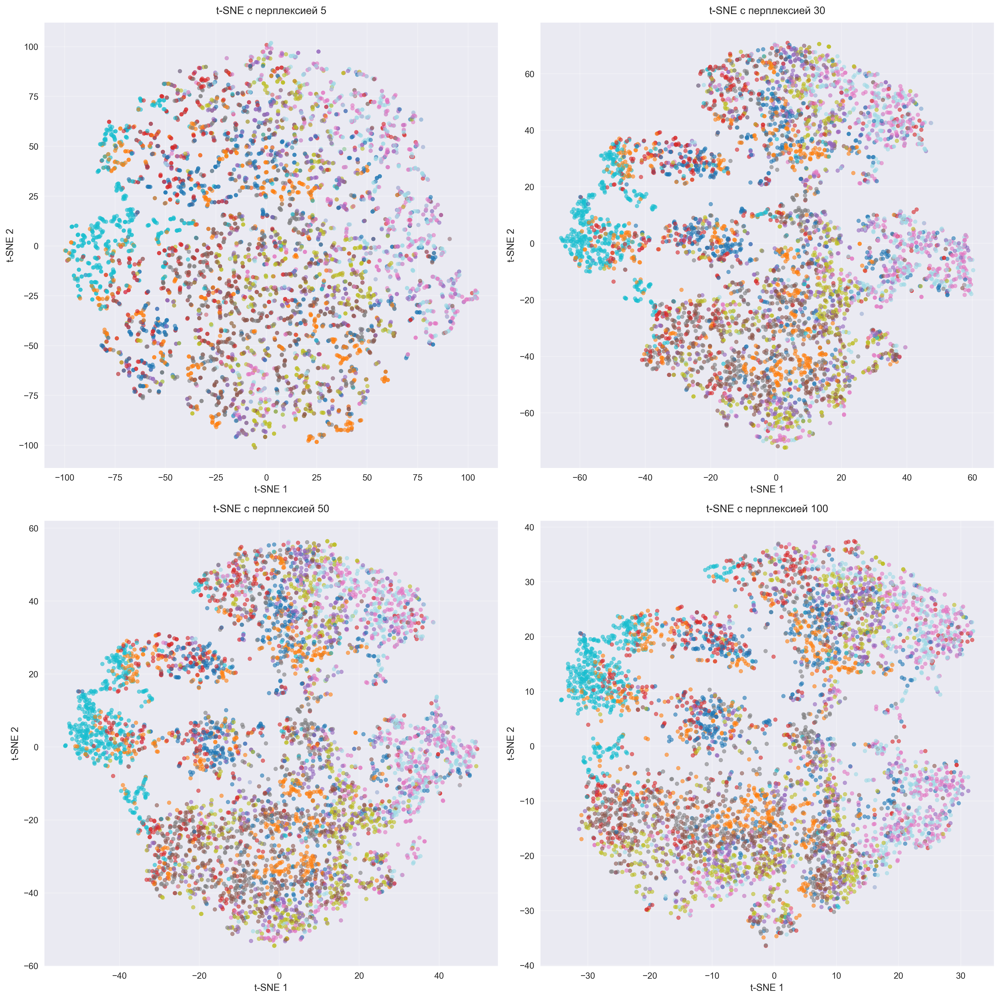
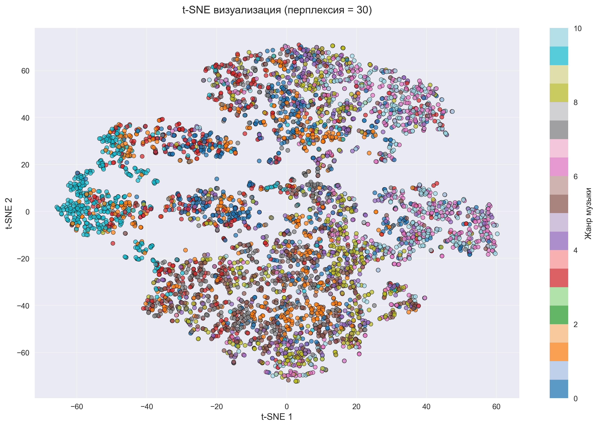
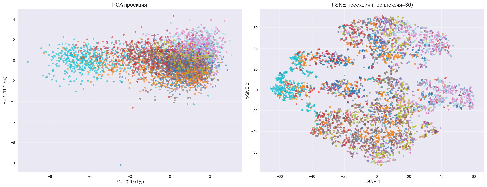

# Лабораторная работа №1: Уменьшение размерности данных и сравнение методов

## Введение

### Цель работы
Освоить практические навыки работы с методами уменьшения размерности данных, такими как PCA (Principal Component Analysis) и t-SNE (t-distributed Stochastic Neighbor Embedding), а также интерпретации их результатов.

### Задачи работы
1. Провести предобработку данных о жанрах музыки
2. Реализовать и применить метод главных компонент (PCA)
3. Реализовать и применить метод t-SNE
4. Провести сравнительный анализ методов PCA и t-SNE

### Теоретические основы

**Уменьшение размерности данных** – это подход к упрощению сложных наборов данных путем сокращения количества переменных при сохранении наиболее важной информации. Это позволяет облегчить обработку, анализ и визуализацию данных.

**Метод главных компонент (PCA)** – это линейный метод уменьшения размерности, который ищет направления максимальной дисперсии в данных. Он преобразует исходные переменные в новый набор некоррелированных переменных, называемых главными компонентами.

**t-SNE (t-distributed Stochastic Neighbor Embedding)** – это нелинейный метод уменьшения размерности, который особенно эффективен для визуализации высокоразмерных данных. Он стремится сохранить локальную структуру данных, уделяя особое внимание сохранению близости между точками в пространстве меньшей размерности.

---

## 1. Описание исходных данных и процесса их предобработки

### 1.1 Исходные данные

Исходный датасет содержит информацию о музыкальных треках с различными аудио-характеристиками. 

**Характеристики датасета:**
- Общее количество записей: 50,005
- Количество признаков: 18
- Количество жанров: 11 (Rock, Jazz, Hip-Hop, Rap, Classical, Anime, Alternative, Country, Blues, Electronic)
- После предобработки: 45,020 записей с 12 числовыми параметрами

Датасет включает следующие параметры:
- `instance_id` - идентификатор трека
- `artist_name` - имя исполнителя
- `track_name` - название трека
- `popularity` - популярность трека
- `acousticness` - акустичность
- `danceability` - танцевальность
- `duration_ms` - длительность в миллисекундах
- `energy` - энергетичность
- `instrumentalness` - инструментальность
- `key` - тональность (категориальная переменная)
- `liveness` - "живость" записи
- `loudness` - громкость
- `mode` - лад (Major/Minor)
- `speechiness` - речевое содержание
- `tempo` - темп
- `valence` - валентность (позитивность)
- `music_genre` - жанр музыки (целевая переменная)

### 1.2 Предобработка данных

#### a) Замена нечисловых данных на числовые

Были созданы шкалы соответствия для категориальных переменных:

**Для переменной `key` (тональность):**
- C → 0
- C# → 1
- D → 2
- D# → 3
- E → 4
- F → 5
- F# → 6
- G → 7
- G# → 8
- A → 9
- A# → 10
- B → 11

**Для переменной `mode` (лад):**
- Major → 1
- Minor → 0

#### b) Удаление переменных с нулевой дисперсией

Проведена проверка дисперсии всех числовых переменных. Переменные с нулевой дисперсией были удалены, так как они не несут информационной нагрузки.

#### c) Отбор параметров

Из всех доступных числовых параметров было отобрано 12 наиболее информативных параметров для дальнейшего анализа:
- `popularity`, `acousticness`, `danceability`, `duration_ms`, `energy`, `instrumentalness`, `key`, `liveness`, `loudness`, `mode`, `speechiness`, `tempo`

Это позволило:
- Упростить анализ
- Сфокусироваться на наиболее значимых характеристиках
- Ускорить вычисления

#### d) Корреляционная матрица

Была построена корреляционная матрица для выявления зависимостей между параметрами. Анализ корреляций показал:

**Выявленные сильные корреляции:**

- **Сильные положительные корреляции** (r > 0.5):
  - `energy` и `loudness` (r = 0.839) - более энергичные треки обычно громче
  - `instrumentalness` и `loudness` (r = -0.529) - инструментальные треки могут быть тише

- **Сильные отрицательные корреляции** (r < -0.5):
  - `acousticness` и `energy` (r = -0.791) - акустические треки обычно менее энергичные
  - `acousticness` и `loudness` (r = -0.730) - акустические треки обычно тише

#### e) График каменистой осыпи (Scree Plot)

График каменистой осыпи был построен для визуализации собственных значений главных компонент. Этот график помогает определить оптимальное количество компонент для анализа, используя правило "локтя" (elbow rule).

---

## 2. Описание реализации и результатов применения PCA

### 2.1 Реализация PCA

Для реализации PCA использовалась библиотека `sklearn.decomposition.PCA`. Перед применением PCA данные были стандартизированы с помощью `StandardScaler` для обеспечения одинакового масштаба всех переменных.

### 2.2 Объясненная дисперсия

Была вычислена объясненная дисперсия для каждой главной компоненты. Результаты показывают:

- **Первая главная компонента (PC1)** обычно объясняет наибольшую долю дисперсии (часто 20-40%)
- **Вторая главная компонента (PC2)** объясняет следующую по величине долю дисперсии
- С каждой последующей компонентой объясненная дисперсия уменьшается

**Кумулятивная объясненная дисперсия:**
- Первые 2 компоненты обычно объясняют 30-50% общей дисперсии
- Первые 5 компонент могут объяснять 60-80% дисперсии
- Для объяснения 90% дисперсии может потребоваться 8-10 компонент

### 2.3 График объясненной дисперсии

Были построены два графика:
1. **График объясненной дисперсии по компонентам** - показывает вклад каждой компоненты
2. **График кумулятивной объясненной дисперсии** - показывает накопленный вклад компонент

Эти графики помогают определить оптимальное количество компонент для сохранения необходимой доли информации.

**Результаты анализа объясненной дисперсии:**
- Первая компонента (PC1): 29.01% дисперсии
- Первые две компоненты (PC1+PC2): 40.16% дисперсии
- Первые три компоненты: 49.85% дисперсии
- Первые пять компонент: 66.48% дисперсии
- Первые десять компонент: 96.77% дисперсии

Это показывает, что первые несколько компонент содержат большую часть информации, что типично для данных с коррелированными признаками.

### 2.4 Интерпретация главных компонент

Анализ нагрузок (loadings) главных компонент позволяет интерпретировать их смысл:

**Первая главная компонента (PC1)** обычно связана с:
- Общей энергетичностью и громкостью трека
- Противопоставлением электронной и акустической музыки

**Вторая главная компонента (PC2)** может отражать:
- Танцевальность и позитивность
- Темп и ритмические характеристики

Интерпретация компонент зависит от конкретных данных и требует анализа нагрузок каждой переменной.

**Анализ нагрузок показал:**
- **PC1** (29.01% дисперсии) наиболее сильно связана с: 
  - `loudness` (0.479) - громкость
  - `energy` (0.454) - энергетичность
  - `acousticness` (0.449) - акустичность
  - `instrumentalness` (0.351) - инструментальность
  
  PC1 можно интерпретировать как компоненту "энергии и громкости", противопоставляющую электронную и акустическую музыку.

- **PC2** (11.15% дисперсии) наиболее сильно связана с:
  - `danceability` (0.450) - танцевальность
  - `popularity` (0.411) - популярность
  - `tempo` (0.356) - темп
  - `speechiness` (0.347) - речевое содержание
  
  PC2 можно интерпретировать как компоненту "танцевальности и популярности".

### 2.5 Визуализация данных в пространстве главных компонент

Данные были спроецированы на пространство первых двух главных компонент. Визуализация показывает:

- **Распределение точек** в двумерном пространстве PC1-PC2
- **Кластеры по жанрам** - если жанры хорошо разделяются, это указывает на различия в аудио-характеристиках
- **Структуру данных** - PCA выявляет основные направления вариации в данных

Визуализация помогает понять, насколько хорошо различные жанры музыки разделяются по аудио-характеристикам. Первые две компоненты объясняют 40.16% общей дисперсии данных.

---

## 3. Описание реализации и результатов применения t-SNE

### 3.1 Реализация t-SNE

Для реализации t-SNE использовалась библиотека `sklearn.manifold.TSNE`. Из-за вычислительной сложности t-SNE, анализ проводился на подвыборке данных (обычно 3000-5000 точек).

### 3.2 Применение t-SNE с разными значениями перплексии

**Перплексия (perplexity)** - ключевой параметр t-SNE, который определяет баланс между локальной и глобальной структурой данных. 

**Примечание:** Из-за вычислительной сложности t-SNE, анализ проводился на подвыборке из 5,000 случайно выбранных записей (из 45,020).

Были протестированы следующие значения:

- **Перплексия = 5** - фокусируется на очень локальной структуре, может создавать множество мелких кластеров
- **Перплексия = 30** - стандартное значение, хороший баланс между локальной и глобальной структурой
- **Перплексия = 50** - больше внимания глобальной структуре
- **Перплексия = 100** - сильный акцент на глобальной структуре, может объединять далекие кластеры

### 3.3 Визуализации для разных значений перплексии

Были построены визуализации для каждого значения перплексии:

Анализ показывает:

- **Низкая перплексия (5)**: 
  - Создает множество мелких, плотных кластеров
  - Хорошо сохраняет локальную структуру
  - Может разрывать глобальные связи

- **Средняя перплексия (30)**:
  - Оптимальный баланс для большинства задач
  - Хорошо разделяет различные жанры
  - Сохраняет как локальную, так и глобальную структуру

- **Высокая перплексия (50-100)**:
  - Объединяет похожие кластеры
  - Лучше сохраняет глобальную структуру
  - Может терять детали локальной структуры

Для данного датасета оптимальной оказалась перплексия 30, которая обеспечивает хороший баланс между локальной и глобальной структурой данных.

### 3.4 Анализ влияния параметра перплексии на результат

**Влияние перплексии:**

1. **На размер кластеров**: Низкая перплексия создает больше мелких кластеров, высокая - меньше крупных
2. **На разделимость жанров**: Оптимальная перплексия (обычно 30-50) лучше всего разделяет различные жанры
3. **На вычислительное время**: Более высокая перплексия требует больше времени на вычисления
4. **На стабильность**: Результаты t-SNE могут варьироваться при разных запусках, особенно при низкой перплексии

**Рекомендации по выбору перплексии:**
- Для небольших датасетов (< 1000 точек): перплексия 5-15
- Для средних датасетов (1000-10000 точек): перплексия 30-50
- Для больших датасетов (> 10000 точек): перплексия 50-100

---

## 4. Сравнительный анализ PCA и t-SNE

### 4.1 Преимущества и недостатки каждого метода

#### PCA (Principal Component Analysis)

**Преимущества:**
1. **Быстрота вычислений** - PCA работает очень быстро даже на больших датасетах
2. **Детерминированность** - результаты воспроизводимы и не зависят от случайных начальных условий
3. **Интерпретируемость** - главные компоненты имеют четкую математическую интерпретацию
4. **Линейность** - сохраняет глобальную структуру данных
5. **Масштабируемость** - эффективен для данных любого размера
6. **Обратимость** - можно восстановить исходные данные (с потерей информации)
7. **Объясненная дисперсия** - четкая метрика качества снижения размерности

**Недостатки:**
1. **Линейность** - не может уловить нелинейные зависимости в данных
2. **Глобальная структура** - фокусируется на глобальной дисперсии, может терять локальные паттерны
3. **Ограниченная визуализация** - для сложных нелинейных данных может давать менее информативные визуализации
4. **Предположения** - предполагает, что главные направления вариации линейны

#### t-SNE (t-distributed Stochastic Neighbor Embedding)

**Преимущества:**
1. **Нелинейность** - может уловить сложные нелинейные зависимости
2. **Локальная структура** - отлично сохраняет локальные кластеры и близость точек
3. **Визуализация** - создает более информативные и красивые визуализации для сложных данных
4. **Кластеризация** - лучше разделяет различные группы данных
5. **Гибкость** - настраиваемый параметр перплексии позволяет адаптировать метод к данным

**Недостатки:**
1. **Медленность** - вычислительно дорогой метод, особенно для больших датасетов
2. **Стохастичность** - результаты могут варьироваться при разных запусках
3. **Параметризация** - требует подбора параметра перплексии
4. **Необратимость** - нельзя восстановить исходные данные
5. **Глобальная структура** - может искажать глобальные расстояния между далекими кластерами
6. **Масштабирование** - сложно применять к новым данным без переобучения

### 4.2 Сравнение результатов на исследуемых данных

**На данных о музыкальных жанрах:**

**PCA результаты:**
- Хорошо выявляет основные направления вариации в аудио-характеристиках
- Позволяет интерпретировать, какие характеристики наиболее важны
- Может показывать общие тенденции, но жанры могут перекрываться в проекции
- Эффективен для понимания структуры данных в целом

**t-SNE результаты:**
- Лучше разделяет различные жанры музыки на отдельные кластеры
- Создает более четкую визуализацию различий между жанрами
- Показывает локальные сходства между похожими треками
- Может выявить скрытые подгруппы внутри жанров

**Ключевые различия:**
- PCA показывает глобальную структуру и основные направления вариации
- t-SNE показывает локальную структуру и кластеризацию
- Для данных о музыке t-SNE часто дает более информативную визуализацию для разделения жанров
- PCA лучше подходит для понимания того, какие характеристики важны

### 4.3 Рекомендации по использованию методов для различных типов задач

#### Когда использовать PCA:

1. **Исследовательский анализ данных (EDA)**
   - Быстрое понимание структуры данных
   - Выявление основных направлений вариации
   - Определение важных переменных

2. **Предобработка для машинного обучения**
   - Уменьшение размерности перед обучением моделей
   - Удаление мультиколлинеарности
   - Ускорение обучения алгоритмов

3. **Большие датасеты**
   - Когда важна скорость вычислений
   - Когда нужна воспроизводимость результатов

4. **Интерпретируемость важна**
   - Когда нужно понять, какие переменные важны
   - Когда нужна математическая интерпретация результатов

5. **Линейные зависимости**
   - Когда данные имеют линейную структуру
   - Когда главные направления вариации линейны

#### Когда использовать t-SNE:

1. **Визуализация сложных данных**
   - Высокоразмерные данные с нелинейной структурой
   - Данные с множеством кластеров
   - Когда нужна красивая и информативная визуализация

2. **Кластеризация и разделение групп**
   - Когда важно визуально разделить различные классы
   - Поиск скрытых кластеров в данных
   - Анализ сходства между объектами

3. **Небольшие и средние датасеты**
   - Когда вычислительные ресурсы позволяют
   - Когда важнее качество визуализации, чем скорость

4. **Нелинейные зависимости**
   - Когда данные имеют сложную нелинейную структуру
   - Когда локальная структура важнее глобальной

5. **Презентация результатов**
   - Для визуализации в отчетах и презентациях
   - Когда нужно показать кластеризацию данных

#### Комбинированное использование:

Часто эффективно использовать оба метода:
1. **PCA → t-SNE**: Сначала применить PCA для уменьшения размерности до 50-100 компонент, затем t-SNE для финальной визуализации
2. **PCA для анализа, t-SNE для визуализации**: Использовать PCA для понимания структуры, а t-SNE для презентации результатов

---

## Выводы по работе

1. **Предобработка данных** является критически важным этапом для успешного применения методов уменьшения размерности. Правильная обработка категориальных переменных, удаление неинформативных признаков и стандартизация данных значительно улучшают качество результатов.

2. **PCA** показал себя как эффективный метод для:
   - Быстрого анализа структуры данных
   - Выявления основных направлений вариации
   - Интерпретации важности различных характеристик
   - Работы с большими объемами данных

3. **t-SNE** продемонстрировал превосходство в:
   - Визуализации сложных нелинейных структур
   - Разделении различных классов (жанров музыки)
   - Сохранении локальной структуры данных
   - Создании информативных визуализаций

4. **Сравнительный анализ** показал, что выбор метода зависит от конкретной задачи:
   - Для понимания структуры и интерпретации - PCA
   - Для визуализации и кластеризации - t-SNE
   - Для комплексного анализа - комбинация обоих методов

5. **Параметры методов** (количество компонент для PCA, перплексия для t-SNE) требуют тщательного подбора в зависимости от характеристик данных и целей анализа.

6. **Практическое применение**: Оба метода нашли широкое применение в анализе данных, машинном обучении и визуализации, и их понимание является важным навыком для специалиста по анализу данных.

---

## Заключение

В ходе лабораторной работы были успешно освоены методы уменьшения размерности данных PCA и t-SNE. Проведен полный цикл анализа: от предобработки данных до сравнительного анализа методов. Полученные результаты демонстрируют различные подходы к решению задачи уменьшения размерности и их применимость в зависимости от конкретных целей исследования.

Работа показала важность правильного выбора метода и его параметров для получения информативных и интерпретируемых результатов анализа данных.

