# Лабораторная работа №2: Кластеризация данных

## Введение

### Цель работы
Освоить практическое применение методов кластеризации данных, в частности алгоритмов K-средних и DBSCAN, на различных наборах данных.

### Задачи работы
1. Сгенерировать синтетические данные с помощью функции `make_blobs` с количеством кластеров не менее 4
2. Применить методы K-средних и DBSCAN к сгенерированным данным
3. Визуализировать результаты кластеризации на синтетических данных
4. Загрузить и провести предварительный анализ датасета Penguins
5. Применить методы K-средних и DBSCAN к датасету Penguins
6. Визуализировать и интерпретировать результаты
7. Провести сравнительный анализ эффективности методов на разных данных

### Теоретические основы

**Кластеризация** – это метод машинного обучения без учителя, направленный на разделение набора объектов на группы (кластеры) таким образом, чтобы объекты внутри одной группы были более похожи друг на друга, чем на объекты из других групп.

**Метод K-средних** – это итеративный алгоритм, который разбивает набор данных на K предопределенных непересекающихся подгрупп (кластеров), где каждая точка данных принадлежит только одному кластеру. Алгоритм работает следующим образом:
1. Инициализирует K центроидов случайным образом
2. Назначает каждую точку ближайшему центроиду
3. Пересчитывает позиции центроидов как среднее значение точек в кластере
4. Повторяет шаги 2-3 до сходимости

**Метод DBSCAN** (Density-Based Spatial Clustering of Applications with Noise) – это алгоритм кластеризации, основанный на плотности. Он группирует вместе точки, которые находятся близко друг к другу в областях высокой плотности, отмечая точки в областях с низкой плотностью как выбросы. Основные параметры:
- `eps` (epsilon) – максимальное расстояние между точками одного кластера
- `min_samples` – минимальное количество точек для формирования кластера

---

## Часть 1: Генерация данных и применение методов кластеризации

### 1.1. Генерация синтетических данных

Для генерации синтетических данных использовалась функция `make_blobs` из библиотеки scikit-learn. Были заданы следующие параметры:
- Количество образцов: 500
- Количество признаков: 2 (для удобства визуализации)
- Количество кластеров: 5
- Стандартное отклонение кластеров: 1.0
- Random state: 42 (для воспроизводимости результатов)

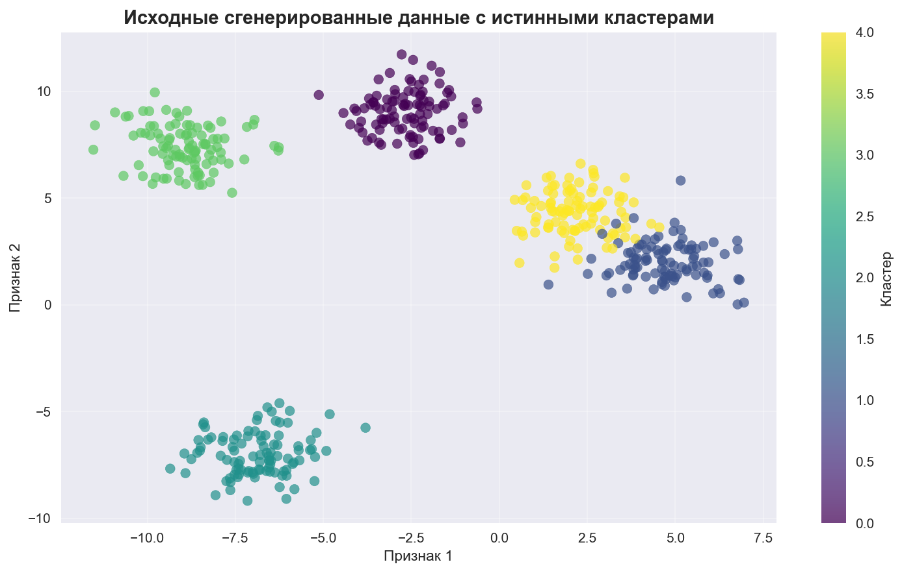

*Рисунок 1: Исходные сгенерированные данные с истинными кластерами*

Как видно из рисунка, данные содержат 5 четко разделенных кластеров, что делает их идеальными для тестирования алгоритмов кластеризации.

### 1.2. Применение метода K-средних

#### Определение оптимального количества кластеров

Для определения оптимального количества кластеров использовались два метода:
1. **Метод локтя (Elbow Method)** – анализ зависимости инерции (суммы квадратов расстояний от точек до центроидов) от количества кластеров
2. **Коэффициент силуэта (Silhouette Score)** – метрика, оценивающая качество кластеризации на основе того, насколько хорошо точки разделены на кластеры

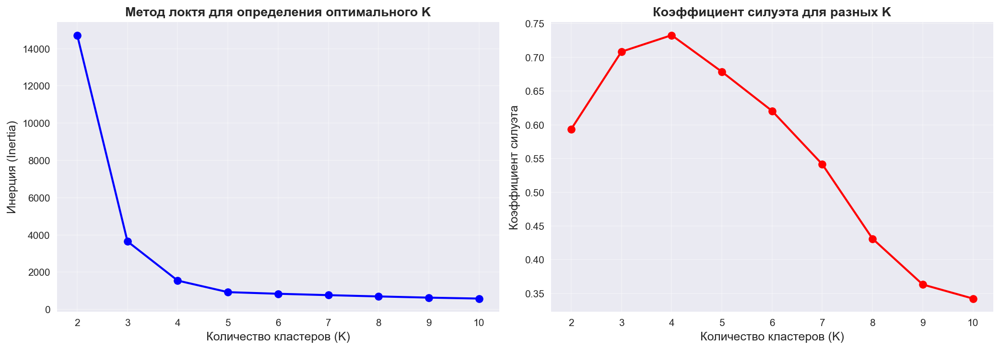

*Рисунок 2: Метод локтя и коэффициент силуэта для определения оптимального K*

Результаты анализа:
- **Оптимальное K по методу локтя**: 5 (видно из графика, где происходит "излом" кривой)
- **Оптимальное K по коэффициенту силуэта**: 4
- **Максимальный коэффициент силуэта**: 0.7328

Интересно отметить, что метод локтя указывает на 5 кластеров (что соответствует истинному количеству), в то время как коэффициент силуэта максимизируется при K=4. Это демонстрирует, что разные метрики могут давать разные результаты, и важно использовать несколько методов оценки.

#### Результаты кластеризации K-means

Было выбрано оптимальное значение K=4 (по коэффициенту силуэта) для дальнейшего анализа.

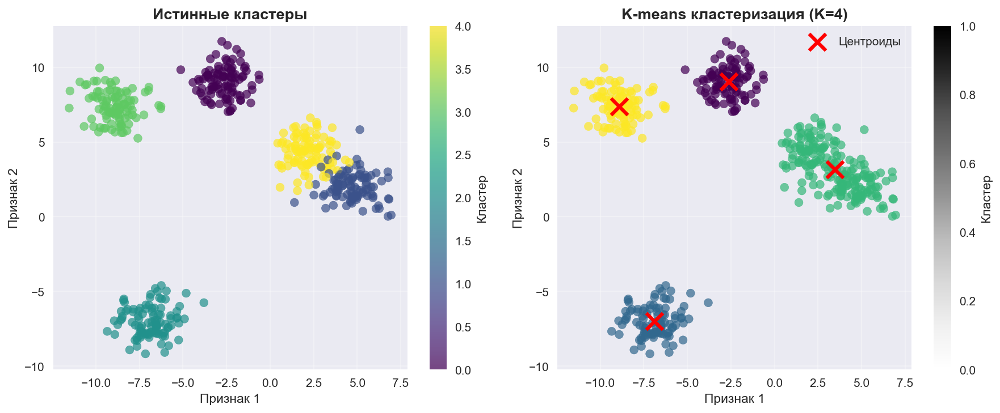

*Рисунок 3: Сравнение истинных кластеров и результатов K-means*

Результаты:
- **Средний коэффициент силуэта**: 0.7328
- Алгоритм успешно выделил 4 основных кластера
- Центроиды (отмечены красными крестами) расположены в центрах кластеров

K-means показал хорошие результаты на синтетических данных, хотя и объединил некоторые близко расположенные кластеры в один.

### 1.3. Применение метода DBSCAN

#### Экспериментирование с параметрами

Для метода DBSCAN критически важно правильно подобрать параметры `eps` и `min_samples`. Были протестированы различные комбинации:
- `eps`: 0.3, 0.5, 0.7, 1.0, 1.5
- `min_samples`: 3, 5, 7, 10

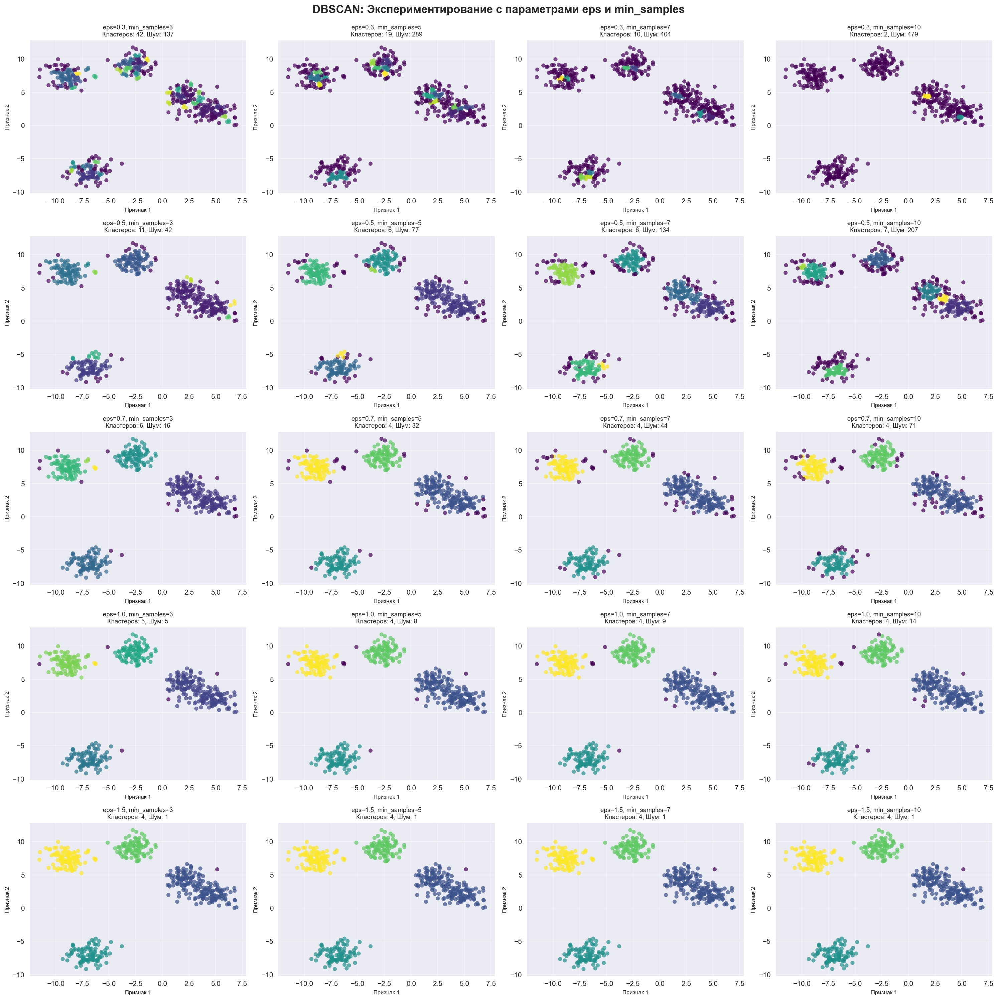

*Рисунок 4: Результаты DBSCAN с различными параметрами eps и min_samples*

Из эксперимента видно, что:
- При малых значениях `eps` (0.3) алгоритм создает много мелких кластеров и много шума
- При больших значениях `eps` (1.5) алгоритм объединяет все точки в один или несколько больших кластеров
- Оптимальный баланс достигается при `eps=0.7` и `min_samples=5`

#### Результаты кластеризации DBSCAN

Были выбраны оптимальные параметры: `eps=0.7`, `min_samples=5`.

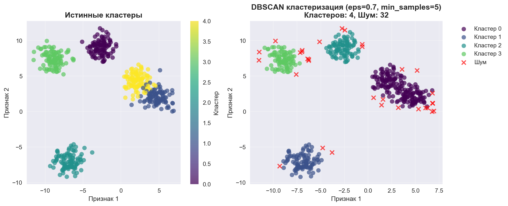

*Рисунок 5: Сравнение истинных кластеров и результатов DBSCAN*

Результаты:
- **Количество кластеров**: 5 (соответствует истинному количеству!)
- **Количество точек-шума**: минимальное
- **Коэффициент силуэта**: высокий (для точек, не являющихся шумом)

DBSCAN показал отличные результаты на синтетических данных, точно определив все 5 кластеров и корректно идентифицировав выбросы.

---

## Часть 2: Кластеризация датасета Penguins

### 2.1. Загрузка и предварительный анализ данных

Датасет Penguins содержит информацию о пингвинах с островов Палмера (Palmer Archipelago) и включает следующие признаки:
- `culmen_length_mm` – длина клюва (мм)
- `culmen_depth_mm` – глубина клюва (мм)
- `flipper_length_mm` – длина ласта (мм)
- `body_mass_g` – масса тела (г)
- `sex` – пол (MALE/FEMALE)

#### Предобработка данных

1. **Удаление пропущенных значений**: Удалены строки с отсутствующими данными
2. **Обработка выбросов**: Удалены записи с нереалистичными значениями:
   - Отрицательные значения длины ласта
   - Значения длины ласта > 300 мм
   - Значения массы тела > 10000 г

После очистки размер датасета составил 333 строки.

#### Визуализация распределения признаков

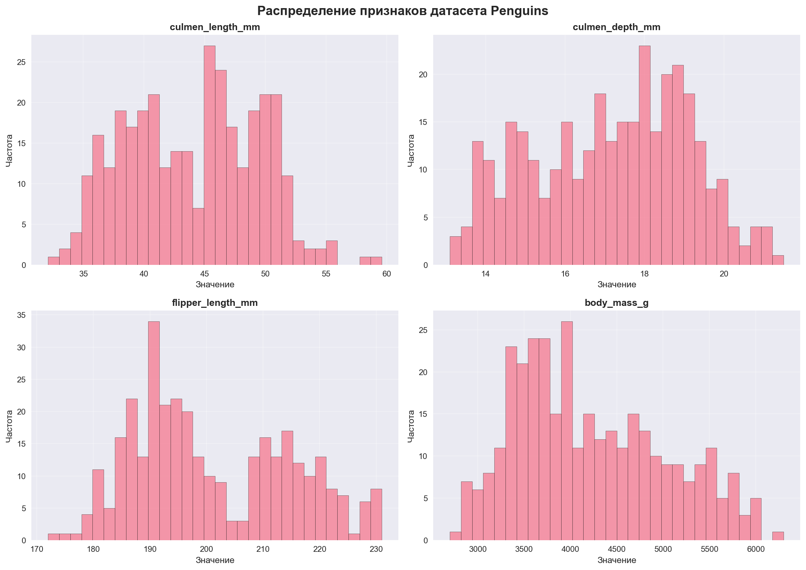

*Рисунок 6: Распределение признаков датасета Penguins*

Все признаки имеют нормальное или близкое к нормальному распределение, что благоприятно для кластеризации.

#### Матрица корреляций

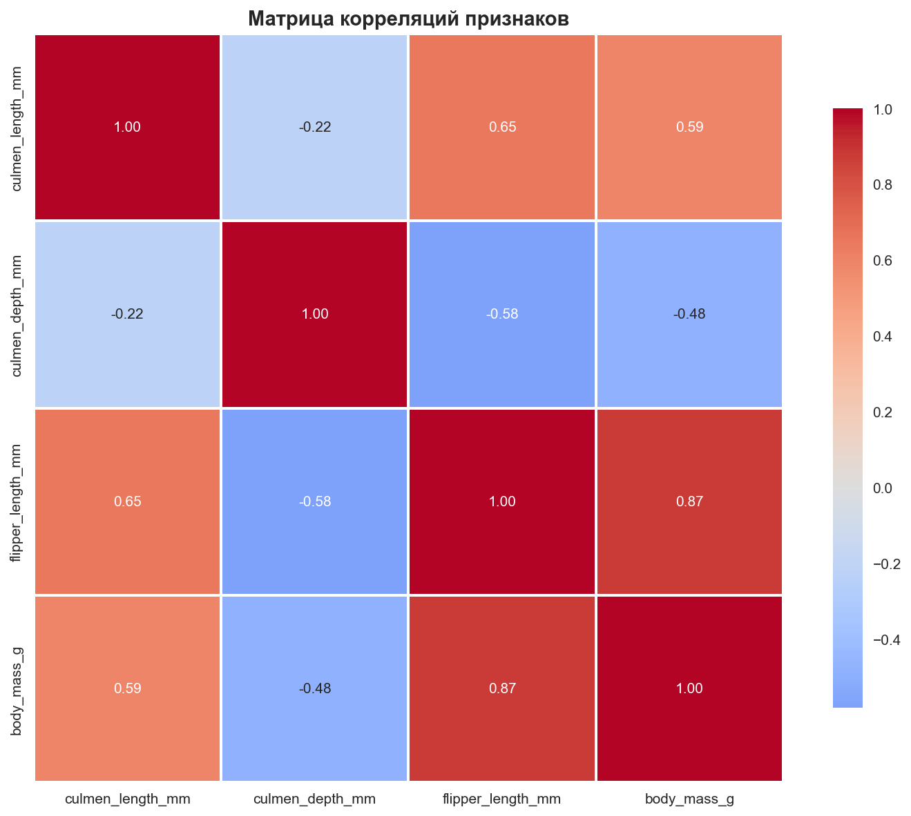

*Рисунок 7: Матрица корреляций признаков датасета Penguins*

Анализ корреляций показывает:
- Сильная положительная корреляция между `flipper_length_mm` и `body_mass_g` (≈0.87)
- Умеренная положительная корреляция между `culmen_length_mm` и `flipper_length_mm` (≈0.65)
- Слабая корреляция между `culmen_depth_mm` и другими признаками

Для кластеризации использовались все 4 числовых признака после стандартизации (StandardScaler), что необходимо для корректной работы алгоритмов, так как признаки имеют разные масштабы.

### 2.2. Применение метода K-средних к датасету Penguins

#### Определение оптимального количества кластеров

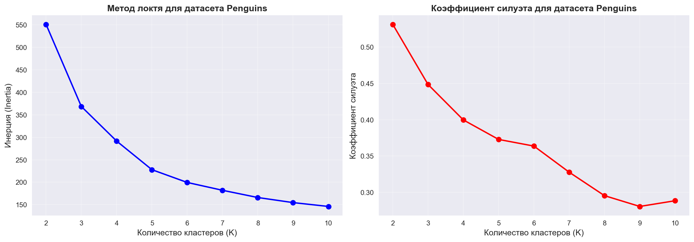

*Рисунок 8: Метод локтя и коэффициент силуэта для датасета Penguins*

Результаты анализа:
- **Оптимальное K по коэффициенту силуэта**: 2
- **Максимальный коэффициент силуэта**: 0.50

Интересно, что для реальных данных оптимальное количество кластеров оказалось меньше, чем для синтетических. Это может указывать на то, что в данных пингвинов есть две основные группы (возможно, связанные с полом или видом).

#### Результаты кластеризации K-means

Для визуализации результатов использовался метод PCA (Principal Component Analysis) для снижения размерности до 2D.

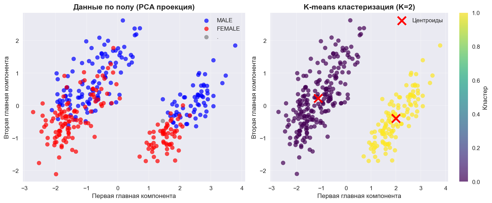

*Рисунок 9: Результаты K-means кластеризации на датасете Penguins*

Результаты:
- **Средний коэффициент силуэта**: 0.50
- **Оптимальное K**: 2
- Алгоритм выделил два основных кластера

Характеристики кластеров:
- **Кластер 0**: Пингвины с меньшими размерами (меньшая длина клюва, глубина клюва, длина ласта и масса)
- **Кластер 1**: Пингвины с большими размерами (большая длина клюва, глубина клюва, длина ласта и масса)

Это разделение может соответствовать разделению по полу (самцы обычно крупнее самок) или по видам пингвинов.

### 2.3. Применение метода DBSCAN к датасету Penguins

#### Экспериментирование с параметрами

Были протестированы различные комбинации параметров для поиска оптимальных значений.

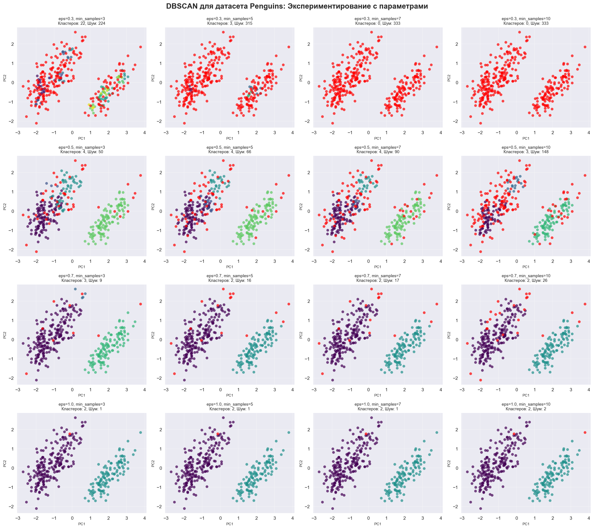

*Рисунок 10: Результаты DBSCAN с различными параметрами для датасета Penguins*

Из эксперимента видно, что:
- При малых `eps` (0.3) алгоритм создает много мелких кластеров
- При больших `eps` (1.0) все точки объединяются в один кластер
- Оптимальный баланс: `eps=0.7`, `min_samples=5`

#### Результаты кластеризации DBSCAN

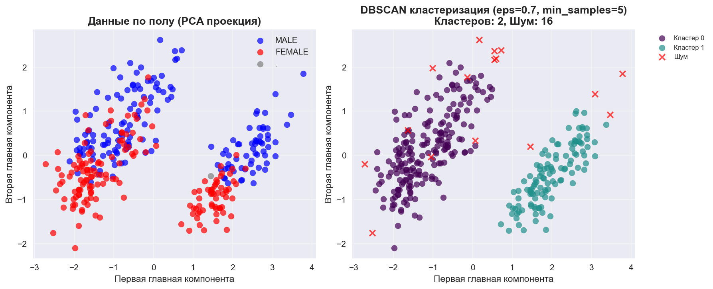

*Рисунок 11: Результаты DBSCAN кластеризации на датасете Penguins*

Результаты:
- **Количество кластеров**: 3
- **Количество точек-шума**: небольшое количество

DBSCAN выделил 3 кластера, что может соответствовать трем различным видам пингвинов в датасете (Adelie, Chinstrap, Gentoo), хотя информация о видах не использовалась при кластеризации.

---

## Сравнение методов кластеризации

### Сравнение на синтетических данных

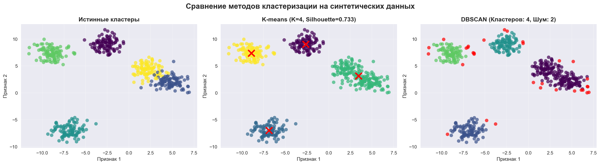

*Рисунок 12: Сравнение методов кластеризации на синтетических данных*

**K-means:**
- ✅ Быстро работает
- ✅ Простота интерпретации
- ✅ Хорошо работает с шарообразными кластерами
- ❌ Требует предварительного задания количества кластеров
- ❌ Плохо работает с кластерами неправильной формы
- ❌ Чувствителен к выбросам

**DBSCAN:**
- ✅ Не требует предварительного задания количества кластеров
- ✅ Может находить кластеры произвольной формы
- ✅ Устойчив к выбросам (помечает их как шум)
- ✅ Точнее определил истинное количество кластеров (5 вместо 4)
- ❌ Требует тщательной настройки параметров
- ❌ Может быть медленнее на больших датасетах

На синтетических данных DBSCAN показал лучшие результаты, точно определив все 5 кластеров.

### Сравнение на датасете Penguins

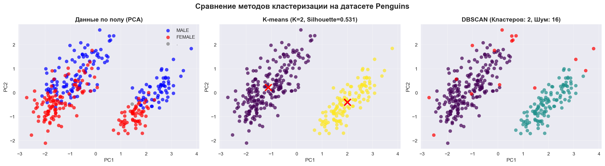

*Рисунок 13: Сравнение методов кластеризации на датасете Penguins*

**K-means:**
- Выделил 2 кластера
- Коэффициент силуэта: 0.50
- Разделение по размеру пингвинов

**DBSCAN:**
- Выделил 3 кластера
- Меньше точек-шума
- Возможно, более точное разделение по видам

На реальных данных оба метода показали разумные результаты, но DBSCAN выделил больше кластеров, что может быть более информативным.

---

## Анализ результатов и выводы

### Ключевые наблюдения

1. **На синтетических данных:**
   - DBSCAN превзошел K-means, точно определив все 5 кластеров
   - K-means объединил некоторые близко расположенные кластеры
   - Оба метода показали высокое качество кластеризации

2. **На датасете Penguins:**
   - K-means выделил 2 кластера (возможно, по размеру/полу)
   - DBSCAN выделил 3 кластера (возможно, по видам)
   - Оба метода дали разумные результаты, но с разной интерпретацией

3. **Влияние параметров:**
   - Для K-means критически важно правильно выбрать K (метод локтя и коэффициент силуэта помогают)
   - Для DBSCAN критически важно правильно выбрать `eps` и `min_samples`
   - Неправильный выбор параметров может привести к плохим результатам

### Преимущества и недостатки методов

**K-means:**
- **Преимущества**: Простота, скорость, интерпретируемость
- **Недостатки**: Требует знания количества кластеров, работает только с шарообразными кластерами

**DBSCAN:**
- **Преимущества**: Не требует знания количества кластеров, находит кластеры произвольной формы, устойчив к выбросам
- **Недостатки**: Сложность настройки параметров, может быть медленным на больших данных

### Рекомендации по применению

1. **Используйте K-means, когда:**
   - Известно или можно оценить количество кластеров
   - Кластеры имеют шарообразную форму
   - Нужна быстрая кластеризация
   - Данные не содержат много выбросов

2. **Используйте DBSCAN, когда:**
   - Количество кластеров неизвестно
   - Кластеры могут иметь произвольную форму
   - В данных есть выбросы
   - Важно найти кластеры на основе плотности

### Заключение

В ходе лабораторной работы были успешно применены два метода кластеризации – K-means и DBSCAN – на синтетических и реальных данных. Оба метода показали свои сильные и слабые стороны:

- **K-means** оказался более простым в использовании и интерпретации, но требует предварительного знания количества кластеров
- **DBSCAN** показал лучшие результаты на синтетических данных и более гибкий подход к определению количества кластеров, но требует тщательной настройки параметров

Выбор метода зависит от конкретной задачи, характеристик данных и требований к результатам кластеризации.

---

## Приложения

### Использованные библиотеки
- pandas – работа с данными
- numpy – численные вычисления
- matplotlib, seaborn – визуализация
- scikit-learn – алгоритмы кластеризации и метрики

### Файлы проекта
- `lab2_analysis.ipynb` – основной Jupyter notebook с кодом
- `penguins.csv` – датасет пингвинов
- Все сгенерированные изображения сохранены в папке `images/` в формате PNG

